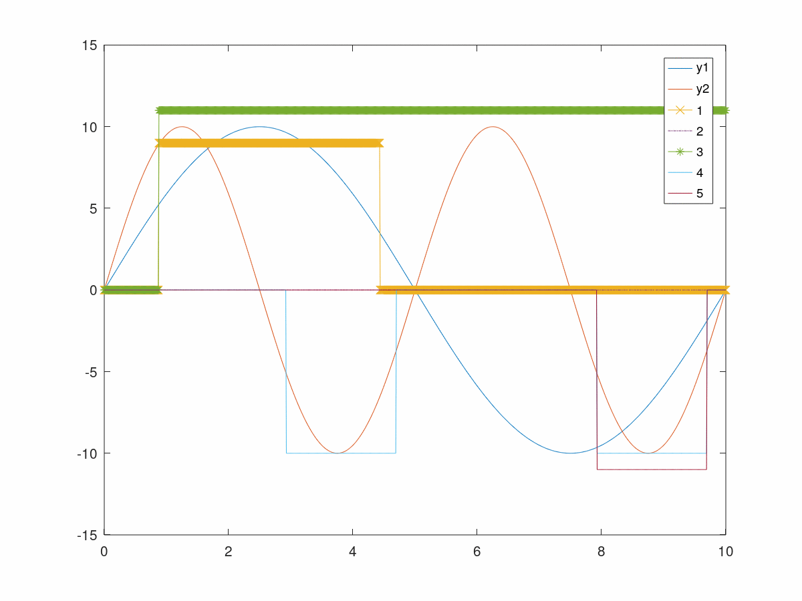

# easy states

*Easy states* is used to manage states of sensor measurements.
States configuration can be configured in a [table](https://github.com/donghao2nanjing/easy_states/blob/master/example/state.csv) as you need.
For easy version control, csv file format is preferred other than xlsx.

## Configuration options

- state: name of state
- number: number of state
- level: level of state. STATE, ALARM, FAULT, CRITICAL are supported by default. You can also add extra level as you need.
- period: check period in milliseconds. If *status.bits.checkby* is *COUNT_CHECK*, this option is ignored.
- valid_time_or_cnt: time or count for state to be valid.
- recover_time_or_cnt: time or count for state to recover invalid.
- valid_threshold: threshold to count as valid.
- recover_threshold: threshold to count as invalid.
- status.bits:
  - valid: 1 stands for valid and 0 for invalid.
  - masked: 1 stands for masked and 0 for unmasked.
  - check_by:
    - PERIOD_CHECK: period configuration is used to compute parameters of counter.
    - COUNT_CHECK: period configuration is ignored.
  - recoverable: the state can recover from valid to invalid.
  - check_unmasked_only: if this bit is set, the state is only checked when unmasked. In other words, the counter variables will not alter when the state is masked.
  - comment: comment for the state

## Validation by example

Prerequisites:

- Octave
- gcc, make, python3
- jupyter-notebook(optional)

Steps:

1. Run the steps in the notebook or run commands under a terminal:

    ```bash
    cd scripts
    python3 generate_initialization.py
    ```

2. Generate test wave: run generate_sinewave.m using Octave. The test wave is stored in sinewave.txt.

3. Compile example code and run:

    ```bash
    cd ../example
    make
    ./main.exe
    ```

4. Plot the results by running see_results.m.
    
